# Architecture: Google Photos Discovery Engine

## Overview

The Discovery Engine is an **AI-powered research pipeline** that ingests raw user feedback from multiple public sources, processes it at scale, and surfaces structured insights about photo retrieval failures — enabling evidence-based product decisions.

The system is designed in **four layers**:

1. **Ingestion Layer** — Collect raw data from public sources
2. **Processing Layer** — Clean, deduplicate, and chunk text
3. **Analysis Layer** — AI-driven extraction, classification, and clustering
4. **Output Layer** — Structured insights, opportunity map, and metric decomposition

---

## System Architecture Diagram

```mermaid
flowchart TD
    subgraph Ingestion["🌐 Layer 1: Data Ingestion"]
        A1[Google Play Store Scraper]
        A2[App Store Scraper]
        A3[Reddit via Apify Actor]
        A4[Google Photos Community Scraper]
        A5[YouTube Comments API]
        A6[Twitter/X & Social Media]
        A7[Forum Scrapers\nXDA, Stack Exchange, etc.]
    end

    subgraph RawStore["🗄️ Raw Data Store"]
        B1[(Raw JSON / SQLite\nPer-Source Partitioned)]
    end

    subgraph Processing["⚙️ Layer 2: Processing Pipeline"]
        C1[Text Cleaner\nHTML strip, dedup, lang filter]
        C2[Relevance Filter\nKeyword + Embedding similarity]
        C3[Chunker\nSentence-level segmentation]
        C4[Metadata Tagger\nSource, date, platform, rating]
    end

    subgraph VectorStore["🔍 Vector Store"]
        D1[(Embeddings DB\nChroma / FAISS)]
    end

    subgraph Analysis["🧠 Layer 3: AI Analysis Engine"]
        E1[Retrieval Problem Extractor\nLLM: tag pain points per chunk]
        E2[Memory Cue Classifier\nWhat info user DID remember]
        E3[Gap Classifier\nWhat info user FORGOT]
        E4[Search Behavior Tagger\nHow they tried to search]
        E5[Opportunity Clusterer\nEmbed + HDBSCAN clustering]
        E6[Evidence Ranker\nFrequency × Signal strength]
    end

    subgraph MetricDecomp["📊 Layer 4: Metric Decomposition Engine"]
        F1[Expression Gap Analyzer\nCan user articulate their memory?]
        F2[Intent Understanding Analyzer\nDoes Photos understand the clue?]
        F3[Result Presentation Analyzer\nAre results easy to evaluate?]
        F4[Refinement Loop Analyzer\nCan user recover from failed search?]
        F5[Opportunity Scorecard\nGap × Volume × Feasibility]
    end

    subgraph Output["📤 Output"]
        G1[Insight Report\nMarkdown / JSON]
        G2[Opportunity Map\nCluster summaries + evidence quotes]
        G3[Metric Decomposition Tree\nUser behavior → product outcome]
        G4[Interactive Dashboard\nOptional: Streamlit / Gradio]
    end

    Ingestion --> RawStore
    RawStore --> Processing
    Processing --> VectorStore
    VectorStore --> Analysis
    Analysis --> MetricDecomp
    MetricDecomp --> Output
```



---

## Layer 1: Data Ingestion

### Sources & Methods

| Source | Method | Tool / API |
|---|---|---|
| Google Play Store | HTTP scraping | `google-play-scraper` (Python) |
| Apple App Store | HTTP scraping | `app-store-scraper` (Python) |
| Reddit | Cloud scraping | **Apify** `trudax/reddit-scraper` actor |
| Google Photos Community | HTTP scraping | `BeautifulSoup` + `requests` |
| YouTube Comments | Official API | YouTube Data API v3 |
| Twitter / X | Search API | `tweepy` or `snscrape` |
| XDA / Stack Exchange | HTTP scraping | `BeautifulSoup` |

### Ingestion Rules
- **Rate limiting**: Respect `robots.txt` and platform rate limits; use exponential backoff
- **Deduplication key**: `(source, content_hash)` — prevent re-ingestion on re-runs
- **Date range**: Configurable window (e.g., last 3 years) to keep signals recent
- **Language filter**: English only (v1); multilingual support via translation in v2
- **Minimum length**: Discard posts < 30 characters (likely noise)

---

## Layer 2: Processing Pipeline

### Steps

```
Raw Text
  → HTML/Markdown Strip
  → Unicode Normalization
  → Deduplication (exact + near-duplicate via MinHash)
  → Relevance Filter  (must mention photo search/retrieval concepts)
  → Sentence Chunking (spaCy sentencizer, max 5 sentences per chunk)
  → Metadata Attachment (source, date, rating, URL, author_type)
  → Embedding Generation (sentence-transformers all-MiniLM-L6-v2, local)
  → Store in Vector DB (ChromaDB)
```

### Relevance Filter — Seed Keywords

The filter accepts a chunk if it contains **≥1 keyword** from either group:

- **Retrieval signals**: `find`, `search`, `looking for`, `remember`, `can't find`, `lost`, `missing`, `retrieve`, `locate`
- **Photo context**: `photo`, `picture`, `image`, `video`, `memory`, `album`, `Google Photos`, `gallery`

Chunks that pass keyword filtering are further scored by **cosine similarity** to a set of seed sentences (e.g., *"I can't find an old photo I remember taking"*). Threshold: ≥ 0.45.

---

## Layer 3: AI Analysis Engine

### 3.1 Retrieval Problem Extractor

**Input**: A text chunk  
**Output**: Structured JSON tagging the retrieval problem described

**Prompt strategy** (LLM call per chunk):
```
Given this user post about Google Photos, extract:
1. retrieval_problem: What photo retrieval problem are they describing? (1–2 sentences)
2. memory_cues: What did the user remember about the photo? (list)
3. forgotten_info: What did the user forget or not know? (list)
4. search_attempts: What search strategies did they try? (list)
5. outcome: Did they find the photo? (found / not_found / unknown)
```

### 3.2 Memory Cue Classifier

Classifies what type of memory the user retained about the photo:

| Memory Cue Type | Examples |
|---|---|
| **Temporal** | "last year", "summer 2019", "when I was sick" |
| **Spatial / Location** | "Goa trip", "my old house", "that restaurant" |
| **People** | "with my mom", "college friends" |
| **Object / Subject** | "the medicine bottle", "my dog", "a sunset" |
| **Event / Context** | "birthday party", "when I graduated" |
| **Visual / Aesthetic** | "blurry", "bright light", "red dress" |
| **Emotion** | "that happy trip", "the sad day" |

### 3.3 Gap Classifier

Classifies what the user **could not** provide during search:
- Missing timestamp
- Missing location
- Missing person name
- Missing exact object name
- Missing album/folder
- No keywords available

### 3.4 Search Behavior Tagger

Tags the strategies users attempt when memory is incomplete:
- Keyword guessing
- Date-range browsing
- Album/folder browsing
- Face search
- Location search
- Scrolling through timeline
- Asking another person
- Gave up

### 3.5 Opportunity Clusterer

1. Embed all extracted `retrieval_problem` strings
2. Run **HDBSCAN** clustering (min_cluster_size=10)
3. Generate a **cluster label** using LLM summarization of the 5 most central chunks
4. Rank clusters by: `frequency × avg_signal_strength`

### 3.6 Evidence Ranker

For each opportunity cluster, surface the **top 5 verbatim quotes** ranked by:
- Specificity of the pain point
- Emotional signal strength (frustration, abandonment)
- Upvotes / rating weight (if available)

---

## Layer 4: Metric Decomposition Engine

Maps evidence clusters to the four diagnostic gaps from the problem statement:

```
Successful Retrieval of Vaguely Remembered Photos
│
├── 1. Expression Gap
│   Can the user articulate what they remember well enough to search?
│   → Evidence: posts where users describe having a memory but no words for it
│   → Metric proxy: % of sessions where search bar is abandoned blank
│
├── 2. Intent Understanding Gap
│   Does Google Photos correctly interpret the vague clues provided?
│   → Evidence: posts where search returned irrelevant results despite clear clues
│   → Metric proxy: zero-result rate on memory-based queries
│
├── 3. Result Presentation Gap
│   Can the user evaluate whether results match their vague memory?
│   → Evidence: posts where users describe scrolling but not recognizing the photo
│   → Metric proxy: time-to-click on search result; result page abandonment rate
│
└── 4. Refinement / Recovery Gap
    Can the user iterate after a failed search?
    → Evidence: posts describing giving up or switching to manual scrolling
    → Metric proxy: % of failed searches with no follow-up query
```

### Opportunity Scorecard

Each identified gap is scored:

| Dimension | Description | Score (1–5) |
|---|---|---|
| **Volume** | How many users report this problem? | Frequency count |
| **Severity** | Do users give up / churn because of it? | Sentiment + outcome tag |
| **Uniqueness** | Is this unaddressed by current features? | Manual assessment |
| **Feasibility** | Is there a known AI/ML solution path? | Manual assessment |
| **Composite Score** | `(Volume × Severity) / (1 + Feasibility_cost)` | Computed |

## Scheduling & Automation

To ensure the Discovery Engine always operates on the latest user feedback, the pipeline is designed to run automatically using **GitHub Actions**.

- **Cron Schedule**: A GitHub Actions workflow is configured to run weekly on **Sunday at 10:00 AM** (`cron: '0 10 * * 0'`).
- **Incremental Updates**: The ingestion scripts are designed to fetch the latest data and deduplicate it against existing records using content hashes.
- **Artifacts**: The final `insight_report.md` and `opportunity_scorecard.json` can be committed back to the repository or published via GitHub Pages.

---

## Technology Stack

| Component | Technology |
|---|---|
| Language | Python 3.11+ |
| Scraping | `requests`, `BeautifulSoup`, `apify-client`, YouTube Data API |
| NLP / Embeddings | `sentence-transformers` (`all-MiniLM-L6-v2`, local) |
| Vector Store | `ChromaDB` (local) or `Pinecone` (cloud) |
| LLM (Analysis) | Groq API — `llama-3.3-70b-versatile` (analysis) / `llama-3.1-8b-instant` (classification) |
| Clustering | `hdbscan`, `scikit-learn` |
| Data Storage | SQLite (raw) + Parquet (processed) |
| Orchestration | Python scripts with `Prefect` or simple sequential runner |
| Output / Dashboard | `Streamlit` or Markdown reports |
| Config Management | `.env` + `pydantic-settings` |
| Scheduling / CI/CD | GitHub Actions (cron jobs for continuous ingestion) |

---

## Project Directory Structure

```
Google Photos Discovery Engine/
├── docs/
│   ├── problemStatement.md       # Problem context
│   └── architecture.md           # This file
│
├── src/
│   ├── ingestion/
│   │   ├── play_store.py         # Google Play scraper
│   │   ├── app_store.py          # Apple App Store scraper
│   │   ├── reddit.py             # Reddit via Apify actor
│   │   ├── youtube.py            # YouTube Comments API
│   │   ├── community.py          # Google Photos community scraper
│   │   └── social.py             # Twitter / X scraper
│   │
│   ├── processing/
│   │   ├── cleaner.py            # HTML strip, normalize, dedup
│   │   ├── relevance_filter.py   # Keyword + embedding filter
│   │   ├── chunker.py            # Sentence segmentation
│   │   └── embedder.py           # Generate + store embeddings
│   │
│   ├── analysis/
│   │   ├── extractor.py          # LLM-based problem extraction
│   │   ├── memory_classifier.py  # Memory cue classification
│   │   ├── gap_classifier.py     # Forgotten info classification
│   │   ├── behavior_tagger.py    # Search behavior tagging
│   │   ├── clusterer.py          # HDBSCAN opportunity clustering
│   │   └── evidence_ranker.py    # Top quote selection
│   │
│   ├── decomposition/
│   │   ├── gap_mapper.py         # Map clusters → 4 diagnostic gaps
│   │   └── scorecard.py          # Opportunity scoring
│   │
│   └── output/
│       ├── report_generator.py   # Markdown report writer
│       └── dashboard.py          # Optional Streamlit dashboard
│
├── data/
│   ├── raw/                      # Raw scraped JSON per source
│   ├── processed/                # Cleaned + chunked Parquet files
│   └── vector_store/             # ChromaDB persistent storage
│
├── outputs/
│   ├── insight_report.md
│   ├── opportunity_map.json
│   └── metric_decomposition.md
│
├── config/
│   └── settings.py               # API keys, thresholds, config
│
├── tests/
│   └── ...
│
├── requirements.txt
└── README.md
```

---

## Data Flow Summary

```
Public Sources
    │
    ▼
[Ingestion Layer]  →  Raw JSON per source  →  raw/ directory
    │
    ▼
[Processing Layer] →  Cleaned chunks + embeddings  →  ChromaDB
    │
    ▼
[Analysis Layer]   →  Structured extractions per chunk  →  Parquet
    │
    ▼
[Decomposition]    →  Gap mapping + opportunity scores
    │
    ▼
[Output]           →  insight_report.md + opportunity_map.json
```

---

## Key Design Decisions

| Decision | Rationale |
|---|---|
| Chunk at sentence level (not post level) | A single Reddit post may contain multiple distinct pain points |
| Use embeddings for relevance filtering | Keyword filter alone misses paraphrased complaints |
| LLM extraction per chunk (not per post) | Finer granularity → more precise memory cue / gap labeling |
| HDBSCAN over k-means | Does not require pre-specifying cluster count; handles noise |
| Map to 4 diagnostic gaps (not open taxonomy) | Keeps output directly tied to the business metric decomposition |
| Local ChromaDB in v1 | Zero infrastructure cost; easy to switch to Pinecone for scale |
